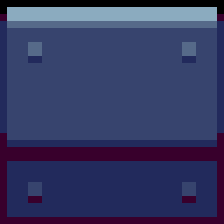
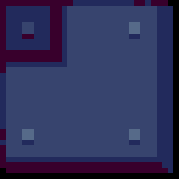
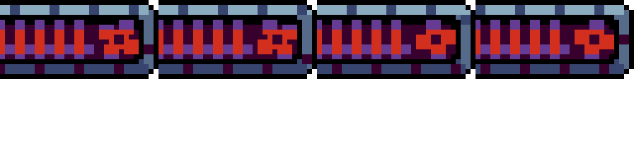
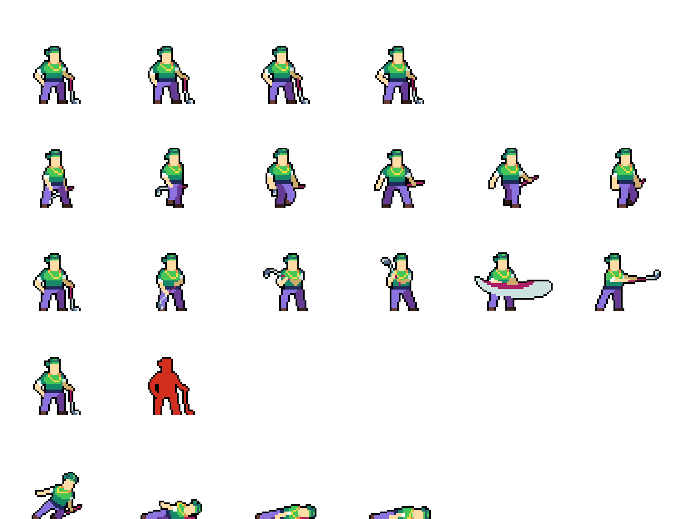
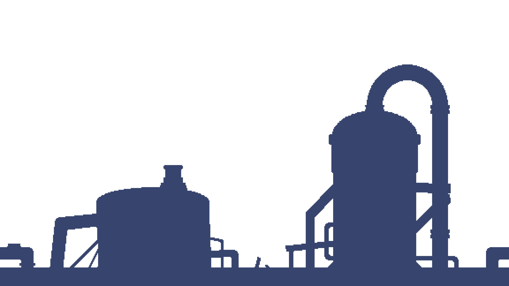

# **Chat client** 
 > **Discaimer :** Il y a ***beaucoup*** d'animation et de chose avec lesquelles on peut intégragir à l'intérieur de ce projet, il se peut donc que j'en oublie. 

---

## *Joueur/Player*
- Un modèle 2D représente le joueur dans l'espace de jeu.

- Si le joueur va à l'extérieur de la *fenêtre*, peu importe le côté de ladite *fenêtre*, un effet de *scrolling* sera enclenché, ce n'est cependant pas en soit une animation du joueur, car celui-ci n'est pas affecté. C'est plutôt tous les autres *sprites* du niveau qui se déplace pour permettre au joueur de continuer à avancer!

- Pour intéragir avec le modèle, on peut utiliser les touches : 
    1. **A** et **D** pour se déplacer vers la *gauche* ou la *droite*. 

    2. **Barre d'Espace** pour faire un *saut* ou un *double saut* si le modèle est déjà dans les airs.

    3. **E** pour intéragir avec différents *objets*, tel que les *échelles* ou les *panneaux*.

    4. **Shift** pour courir si on se déplace déjà.

    5. **Q** , **Bouton de souris Gauche** et **Bouton de souris Droite** pour *attaquer* des *ennemies*, **Q** et **Bouton de souris Gauche** peuvent être utiliser pour faire une *attaque* en *courant*.

- Liste des animations :
    1. Si on n'*intéragit* pas avec le *joueur* et qu'il n'est pas entrain de *tomber*, une animation d'**inactivitée** joue.

    2. Si le *joueur* se déplace vers la *gauche* ou la *droite* sans courir et qu'il n'est pas entrain de *sauter*, une animation de **marche** joue.

    3. Si le *joueur* se déplace vers la *gauche* our la *droite* en courant et qu'il n'est pas entrain de *sauter*, une animation de **course** joue.

    4. Si le *joueur* saute, une animation de **saut** joue.

    5. Si le *joueur* saute alors qu'il se trouve déjà dans les airs, une animation de **double saut** joue.

    6. Si le *joueur* attaque avec le bouton **Q**, une animation de *coup de pied* joue. Le *joueur* peut faire *dommage* aux *ennemies* durant cette animation.

    7. Si le *joueur* attaque avec **Bouton de souris Gauche**, une animation de *coup de poing* joue. Le *joueur* peut faire *dommage* aux *ennemies* durant cette animation.

    8. Si le *joueur* attaque avec **Q** ou **Bouton de souris Gauche** tout en *courant*, une animation de *coup de poing en courant* joue. Le *joueur* peut faire *dommage* aux *ennemies* durant cette animation.

    9. Si le *joueur* attaque avec **Bouton de souris Droite**, une animation d*attaque laser* joue. Le *joueur* ne peut pas se *déplacer* durant cette animation. Le *joueur* peut faire *dommage* aux *ennemies* durant cette animation.

    10. Si le *joueur* intéragit avec une *échelle*, une animation d'*escalade* joue.

    11. Si le *joueur* se fait attaquer par un *ennemie* et qu'il lui reste plus de 0 point de vie suite à l'attaque, une animation de *prise de dommage* joue.

    12. Si le *joueur* se fait attaquer par un *ennemie* et qu'il lui reste 0 point de vie ou moins, une animation de *mort* joue tout au long de la période où le joueur est immunisé au dommage. 

 > **PS :** Toutes les animations jouent en étant orientées dans la direction où le joueur c'est déplacé en dernier. Par défaut le joueur est généralement orienté vers la droite (À l'exception d'un point de réapparition dans la page 'register').

## Objets/Objects

### Plancher/Tiles

    Plusieurs modèles 2d représente plancher/mur/plafond des différents niveaux. Ceux-ci font partie d'un système de collision avec le joueur, ce dernier ne peut donc pas rentrer dans une tile, mais il peut cependant se tenir sur l'une d'entre elle. Les tiles ont une position relative à un point Y, ce qui leur permet de rester en place si la taille de l'écran est changée. Les tiles sont parfois utilisées pour délimiter la zone jouable des niveaux, les zones où les ennemies peuvent se déplacer ou encore pour mettre en place des points de réapparritions.  

### Échelles/Ladders

    Un modèle 2d représente les échelles, celle-ci sont répartie un peu partout dans la page index ainsi que la page register. Elles ne possèdent pas d'animation, mais le joueur peut intéragir avec elles s'il se trouvent suffisament proche. Le joueur peut intéragir à n'importe qu'elle hauteur de l'échelle pour enclencher l'animation, mis à part sur la dernière tuile de l'échelle. 

### Tableaux/Boards

    Un modèle 2d représente les tableaux, ceux-ci sont répartie un peu partout dans la page index, endroit où il est possible d'intéragir avec eux. Ils sont aussi utilisés dans la page register ainsi que la page chat, mais le joueur ne peut pas directement intéragir avec. Les tableaux prennent la forme de tableaux en liège, mais aussi parfois de personnage avec qui le joueur peut intéragir grâce à la touche E. Suite à l'intéraction, une boite noir apparait à l'écran, présentant un message au joueur. Certains messages apparaissent automatiquement lorsque la page a fini de charger ou lorsque le joueur se rend à un certain endroit dans le niveau, tel que lorsque le joueur rentre dans l'arène contenant le boss de la page register. Les messages se glissent dans l'écran avec une petite animation, dépendant si le joueur est au dessus de la moitié de l'écran, le message va apparaitre en haut ou en bas de l'écran. Le message est affiché grâce à la modification de innerHTML.    

### Portes/Entries

    Un modèle 2d représente les portes, celles-ci sont uniquement présentent dans la page register. Les portes ont une condition qui doit être remplie pour pouvoir s'ouvrir. Autrement le joueur sera bloqué par les portes. La condition pour débloquer les portes dans la page register est que tout les mobs doivent être unalived, les barils n'ont pas besoin d'être détruit. Une fois que la condition est remplie, lorsque le joueur se trouve à gauche de la porte et est suffisament proche, celle-ci va s'ouvrir et le joueur peut à présent progresser. Lorsque le joueur sort du range la porte, celle-ci se referme. Une porte ne s'ouvrira pas pour le joueur si celui-ci se trouve à droite de la porte. 

### Tapis roulant/Treadmills

    Un modèle 2d représente les tapis roulant, ceux-ci se trouvent toujours sous les marteaux. Ils font avancer le joueur vers la droite dans la page index et vers la gauche dans la page register lorsque le joueur se trouve sur un tapis roulant. Les tapis roulant ont une animation par défaut.

### Platformes/Platforms

    Un modèle 2d représente les platformes, celles-ci sont présente dans la page index ainsi que dans la page register. Chaque platforme est sur un cycle d'animation différent de celle se trouvant à sa droite ou gauche. Lorsque celles-ci sont fermées, le joueur peut marcher dessus, alors que si elles sont ouverte, le joueur tombera hors du niveau.

## Ennemies

### Barrils/Barrels

    Un modèle 2d représente les barrils, ceux-ci sont présent dans toutes les pages par défaut, à l'exception de la page chat qui doit utiliser la commande /Barrel ou /barrel pour en faire apparaitre. Le joueur peux attaquer les barrils s'il est suffisament proche de l'un d'entre eux, une animation jouera alors pour représenter la période de temps où le barril est immunisé au dommage. Si le barril n'a plus de point de vie, le modèle est changé pour un modèle de barril détruit.  

### Mobs

    Un modèle 2d représente les mobs, les mobs sont présent dans la page register ainsi que dans la page chat si on entre la commande dans le chat /Mob ou /mob. Les mobs peuvent interragir avec le joueur en lui faisant du dommage ou bien en prennant du dommage de la part du joueur. Dans la page chat, on ne peut spawn que 5 mobs à la fois. 

- Liste d'animation: 
    1. Si le *joueur* est à l'extérieur du range du mob, une animation d'*innactivité* joue.

    2. Si le *joueur* est à l'intérieur du range du mob, une animation de *marche* joue.

    3. Si le *joueur* est suffisament proche du mob, celui-ci va tenter de l'attaquer et une animation d'*attaque* joue.

    4. Si le *joueur* attaque le mob et que celui-ci a plus de 0 points de vie, une animation de *prise de dommage* joue. 

    5. Si le *joueur* attaque le mob et que celui-ci a 0 points de vie ou moins, une animation de *mort* joue. Si le mob se trouvait dans la page chat, alors il est removed de la page et un nouveau mob peu maintenant être spawned si le maximum de mob avait été atteint. 

### Boss

    Un modèle 2d représente le boss, celui-ci est présent à la fin de la page register dans l'arène. Le boss possède deux phases. Dans la page register, lorsque le boss est battu, le register form apparait au dessus de la tête du joueur. Le boss peut interragir avec le joueur en lui faisant du dommage ou bien en prennant du dommage de la part du joueur. Dans la page chat, on ne peut faire spawn qu'un boss à la fois. 

- Liste d'animation :
    - Phase 1 (Dans son véhicule):
        1. Le *boss* charge vers la position X du joueur, une animation de *conduite* joue.

        2. Lorsque le *boss* a fini de conduire vers le joueur, une animation d'*innactivité* joue.

        3. Lorsque le *boss* prend du dommage de la pars du joueur et qu'il a plus de 0 points de vie pour sa première phase, une animation de *prise de dommage* joue. 

        4. Lorsque le *boss* a 0 point de vie ou moins pour sa première phase, une animation de *mort* joue.

        5. Lorsque le *boss* a joué son animation de mort et que 5 secondes se sont écoulées, une animation de *sortie de véhicule* joue. Le boss entre alors dans sa deuxième phase.  

    - Phase 2 (Hors de son véhicule): 
        1. Le *boss* se dirige vers le *joueur*, une animation de *marche* joue.

        2. Lorsque le *boss* est suffisament proche du joueur, il tente de l'attaquer, une animation d'*attaque* joue. 

        3. Suite à une attaque, le *boss* arrête de bouger pendant un petit lapse de temps, une animation d'*innactivité* joue.

        4. Lorsque le *joueur* attaque le *boss* et que celui-ci a plus de 0 points de vie dans sa deuxième phase, une animation de *prise de dommage* joue. 

        5. Lorsque le *joueur* attaque le *boss* et que celui-ci a 0 points de vie ou moins dans sa deuxième phase, une animation de *mort* joue. Si le boss se trouvait dans la page chat, alors il est removed de la page et un nouveau boss peu maintenant être spawned. 

### Marteaux/Hammers

    Un modèle 2d représente les marteaux, ceux-ci sont présent dans la page index ainsi que la page register. Ils sont toujours accompagné de tapis roulant. Les marteaux peuvent attaquer et faire du dommage au joueur. Après une seconde, l'animation des marteaux s'enclenchent simultannement. C'est durant cette animation que le joueur peut prendre du dommage. 

## Background

    Le background est composé de 5 images superposées les une sur les autres. Elles ont toutes une vitesse différente de déplacement vers la gauche.

## Forms

    La form login est à une position fixe basé sur la position d'une tile. Lorsque la souris est mis au-dessus, le jeu est mis en pause et est brouillé. Écrire dans les champs de la form, n'intéragit pas avec le modèle du joueur. Si la souris est sortie de la form, le jeu n'est plus en pause et les champs de la form sont mis hors focus. 

    La form register est invisible durant tout le niveau. Lorsque le joueur bat le boss du niveau, la form devient visible et est placé au dessus de la tête du joueur, même si ce dernier se déplace. Lorsque la souris est mis au-dessus, le jeu est mis en pause et est brouillé. Écrire dans les champs de la form, n'intéragit pas avec le modèle du joueur. Si la souris est sortie de la form, le jeu n'est plus en pause et les champs de la form sont mis hors focus. 

## Chat

    Le chat contient un bouton "sign out" qui nous permet de nous déconnecter. Un bouton "show members"/"hide members", qui nous permet de faire afficher une liste des membres en ligne. S'il y a trop de membre en ligne, une scroll bar est disponible pour se déplacer dans la liste. Un bouton "send message" qui nous permet d'envoyer notre message. 

    Lorsqu'un message est envoyé par un membre, le nom dudit membre ainsi que son message est affiché dans le chat. Si trop de message sont présent dans le chat, une scroll bar est disponible pour se déplacer dans le chat. Lorsqu'un nouveau message est envoyé, le chat descend automatiquement pour montrer le nouveau message. Si @ est mis devant le nom d'un membre en ligne, le mot "tous" ou bien le mot "all", le nom/mot sera mis en bleu. On peut aussi rentrer des commandes tel que /Barrel, /Mob ou /Boss pour faire apparaitre lesdits ennemies. 